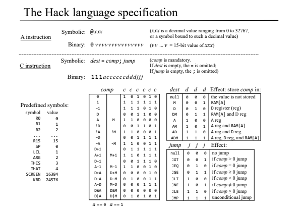
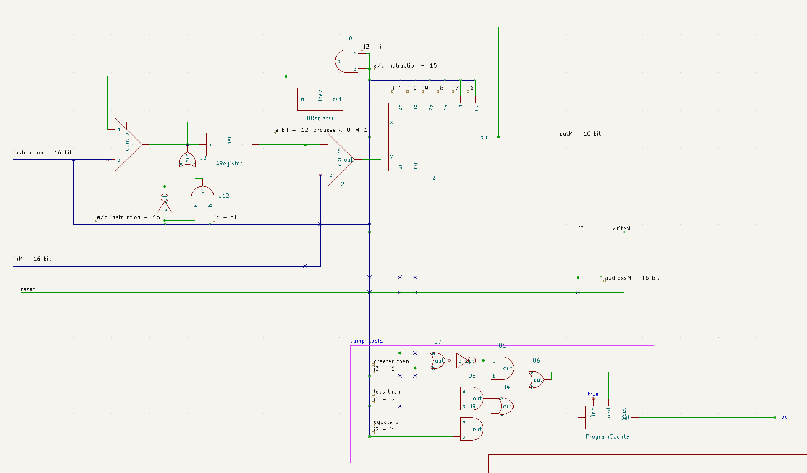

# nand2tetris
Follows the program and assignments detailed in *The Elements of Computing Systems*.

Part 1 of this project (Projects 1-6) focus on the replication of a single set of instructions in both hardware and software. This duplication is the bridge that forms the foundation of modern computing.

Instruction Set

CPU Diagram

### Hardware 
Assignments 1,2,3, and 5 focus on designing and simulating the Hack computer's hardware from elementary logic gates, includes building the ALU, memory, program counter, and control logic. 

### Software
Assignment 4 and 6 focus on the low level instructions of the Hack platform, culminating in writing an assembler to translate the designated assembly commands into machine code. 

